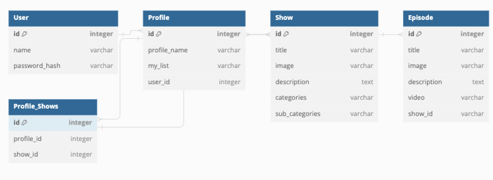

# YouFlix

## Created By Treneese Johnson, Ken Richlin, Shane Lee and Ibraham Younas

## Get the latest version from our [Github Repo](https://github.com/Treneese/YouFlix)

## Screenshot of our front page

## Setup Instructions

- To initialize the environment, type `pipenv install && pipenv shell`
- Enable bcrypt by typing `pip install flask-bcrypt`
- You should populate the database with some test data by running `python server/seed.py` (maybe do this in config to skip this step when we deploy?)
- Start the server by typing `python server/app.py` (change this after deployment)
- In a new terminal window, type `npm install --prefix client` to initialize the front.
- You can then Run YouFlix by typing `npm start --prefix client`

## Let's Watch YouFlix!

Welcome to YouFlix!  We have all the best videos on the internet.  Just go ahead and create a profile, log yourself in, and save your favorite shows to your profile.  

## Details on the Files in the Project

- README.md - The file you're reading right now!
- server/config.py - This is where we load all the libraries we use in the project, including Flask, Bcrypt, CORS, restful and sqlalchemy.  This is also where we initialize and seed the database.
- server/seed.py - This contains sample data to seed the database, with help from Faker.
- server/debug.py - A debug file to assist in testing our class methods (maybe remove this before deployment)
- server/app.py - This file manages the backend, and is responsible for loading the models for the database as well as hosting the views for our app.
- server/models.py - This file his home to all the model classes that make up the database.  Here you will find a variety of ORM methods that interact with the databse.
- server/instance/app.db - This is our SQLite database containing user and show info.
- client/src/App.js - This is where we load the React app that is responsible for displaing our front end.
- client/src/HomePage.css, Login.css, Profile.css - These files contain the CSS statements that style our site.
- client/src/Login.js - A page where you can log into YouFlix
- client/src/Profile.js - A Page where you can see your favorite shows displayed
- client/public - This is the public directory where we host our index.html file

## Screenshot of our Object Diagram

